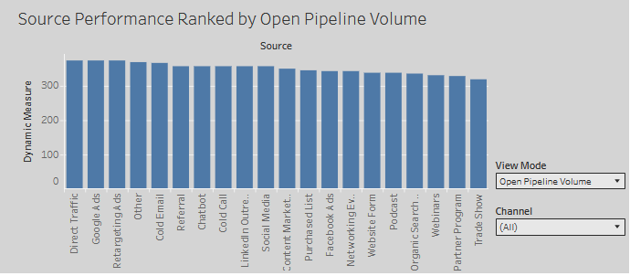
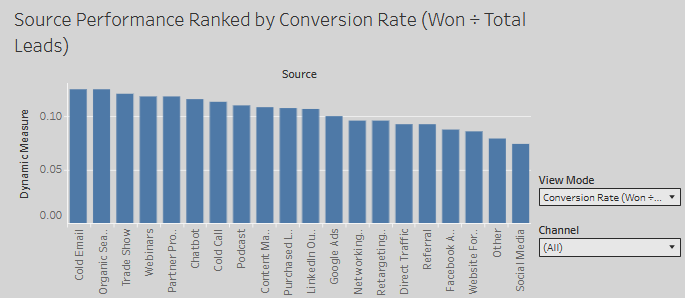
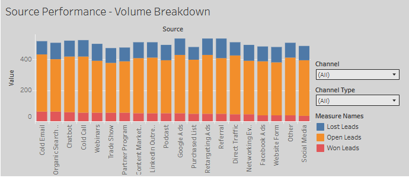
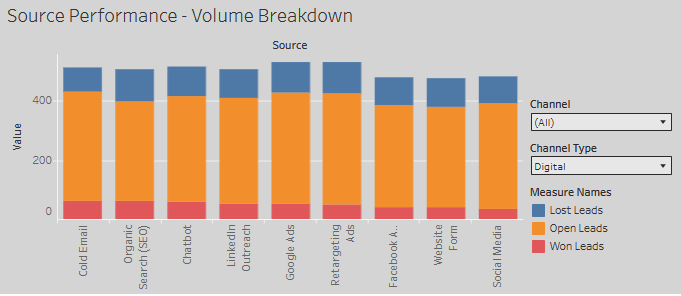
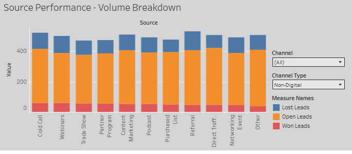

# Sales Lead Funnel Analysis

## Overview
This project analyzes a synthetic sales leads dataset to measure funnel conversion rates from lead creation through conversion. The objective is to identify funnel drop-off points and surface actionable insights that can improve lead qualification, follow-up strategy, and overall sales performance.

The project demonstrates an end-to-end analytics workflow, including data cleaning, validation, SQL-based aggregation, Excel quality assurance checks, and Tableau dashboarding.

---

## Business Question
How are sales leads distributed across funnel stages, and what overall outcomes (Won, Lost, Open) are observed?

Key questions addressed:
- What percentage of total leads fall into each funnel stage and final outcome?
- Which funnel stages contain the highest concentration of lost or stalled leads?
- Where should sales teams focus to improve funnel efficiency?
- How can funnel performance be clearly communicated to stakeholders?
- Which lead sources deliver scale versus conversion efficiency?


---

## Dataset
- **Source:** Synthetic CSV dataset from Datablist
- **Format:** CSV
- **Records:** 10,000 sales leads with defined lifecycle stages
- **Example Fields:**
- Lead Source / Channel
- Funnel Stage
- Deal Outcome
- Supporting metadata fields


Raw and cleaned datasets are stored separately to preserve data lineage, reproducibility, and auditability.

---

## Project Workflow
1. Ingested raw sales lead data (CSV)
2. Performed initial data quality checks and validation in **Excel**
3. Saved a cleaned, verified CSV for analysis
4. Applied funnel logic and created analytical fields in **SQL**
5. Calculated funnel stage distributions and overall outcome metrics in SQL
6. Built an interactive **Tableau dashboard** to visualize lead flow and drop-offs

---
```text
## Project Structure
sales_lead_funnel_analysis/
│
├── data/
│ ├── raw_data/
│ │ └── leads_raw.csv
│ ├── cleaned_data/
│ │ └── leads_cleaned.csv
│
├── excel/
│ └── lead_validation_checks.xlsx
│
├── sql/
│ ├── 01_create_tables.sql
│ ├── 02_data_cleaning.sql
│ ├── 03_funnel_metrics.sql
│ └── 04_conversion_rates.sql
│
├── tableau/
│ └── sales_lead_funnel_dashboard.twbx
│
├── screenshots/
│ └── funnel_dashboard.png
│
└── README.md
```

---

## Tools & Technologies
- **Excel** – Initial data inspection, duplicate checks, and QA validation
- **SQL (SQLite)** – Funnel stage standardization, KPI creation, and aggregation
- **Tableau** – Interactive dashboard for funnel visualization
- **CSV** – Synthetic sales leads dataset

---

## Data Cleaning & Validation

### Excel (Initial QA)

Before applying SQL logic, the raw dataset was reviewed in Excel to ensure data quality:
- Verified total row count (~10,000 records)
- Checked for duplicate records (none found)
- Confirmed no missing Deal Stage values; minor formatting inconsistencies were standardized later in SQL.
- Visually inspected Deal Stage consistency
No critical data quality issues were identified, so no rows were removed.
This ensured that downstream funnel metrics reflected the full lead population without introducing bias.
A cleaned dataset was saved for downstream SQL processing.


### SQL (Analytical Cleaning)

SQL was used to:
- Standardize Deal Stage values into ordered funnel stages
- Add a binary conversion flag (is_converted)
- Aggregate leads by stage and source to compute funnel distributions and conversion rates
- Rename columns for consistency and usability
- Preserve all validated records for analysis
This separation ensures that Excel handles data quality, while SQL encodes business logic.

---

## Funnel Metrics (SQL)
Using SQL, leads were aggregated by funnel stage to calculate:
- Total leads per stage
- Percentage of total leads by stage
- Overall funnel outcomes (Won / Lost / Open)

These KPIs make it easy to identify bottlenecks and prioritize improvements in the sales process.

---

## Assumptions & Limitations

This analysis is based on a snapshot dataset where each lead appears once with a single current Deal Stage.  
Because the data does not include time-ordered stage transitions or historical progression, true stage-to-stage conversion rates cannot be calculated.

As a result:
- Funnel analysis focuses on lead distribution by stage
- Conversion analysis is limited to overall outcomes (Won / Lost / Open)
- Stage-to-stage conversion rates are intentionally not reported to avoid misleading conclusions

These assumptions ensure that reported metrics accurately reflect the structure and limitations of the underlying data.

---

## Tableau Dashboard
The Tableau dashboard visualizes:
- Lead counts by funnel stage
- Overall funnel outcomes (Won / Lost / Open)
- Channel performance ranked by either open pipeline volume or conversion rate via an interactive toggle

This design allows stakeholders to directly compare scale versus efficiency across lead sources.


## 📸 Dashboard Preview

The following screenshots highlight the key analytical views surfaced in the Tableau dashboard.

### 1. Full Funnel Overview
  
Shows lead distribution across funnel stages and overall outcomes (Won / Lost / Open).

### 2. Channel Performance – Open Pipeline Volume
  
Ranks lead sources by open pipeline volume to highlight channels that drive scale.

### 3. Channel Performance – Conversion Efficiency
  
Ranks lead sources by conversion rate to identify high-efficiency channels.

### 4. Source Volume Breakdown
  
Displays open, won, and lost leads by source to provide contextual volume comparison.

---

<details>
<summary><strong>Additional Views (Optional)</strong></summary>

These views are accessible via dashboard filters and are included for completeness.

### Digital Channel Volume Breakdown


### Non-Digital Channel Volume Breakdown


</details>


---

## Key Insights
- Cold Email, Organic Search, Trade Shows, and Webinars rank among the most efficient channels by conversion rate, despite contributing lower overall pipeline volume.
- Direct Traffic, Google Ads, and Retargeting dominate open pipeline volume but convert less efficiently, highlighting a clear tradeoff between scale and efficiency.
- Overall conversion remains low (~10%), with most leads still open, suggesting greater opportunity in improving deal progression rather than increasing lead volume.


---

## Next Steps / Enhancements
- Segment funnel metrics by lead source or channel
- Track funnel performance over time
- Add revenue attribution for converted leads
- Automate data refresh and dashboard updates

---

## Why This Project Matters
This project demonstrates practical, job-relevant data analyst skills:
- Translating business questions into measurable KPIs
- Cleaning and validating real-world-style datasets
- Writing clear, maintainable SQL for analysis
- Communicating insights visually with Tableau

It mirrors the type of funnel analysis commonly used by sales, marketing, and operations teams in real organizations.

## Reproducibility
All data processing steps are documented and repeatable. Raw data is preserved separately from cleaned data, SQL scripts are versioned, and the Tableau workbook can be refreshed using the cleaned CSV without manual intervention.
